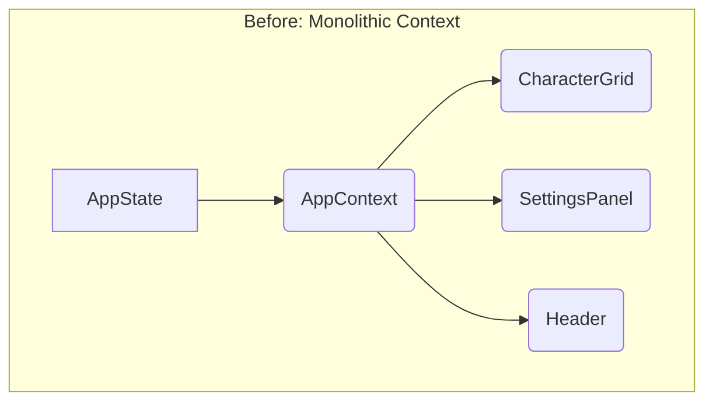
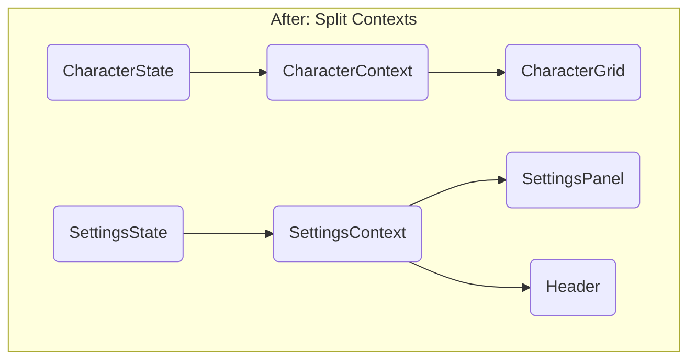

-----

## \#\# Architectural Recommendation: Performance Migration Plan 🚀

### \#\# Executive Summary (TL;DR)

  * **The Problem:** Our app uses a single, monolithic `AppContext`. This causes any small state change (like typing in a text field) to re-render every component that uses the context, leading to UI lag.
  * **The Solution:** We will refactor the single context into multiple, smaller, feature-focused contexts (e.g., `SettingsContext`, `CharacterContext`). This will ensure components only re-render when the specific data they care about actually changes.
  * **The Recommendation:** We will proceed with the **Split Context** approach, as it's a natural evolution of our current `useReducer` architecture. A future migration to a library like Zustand remains an option if complexity continues to grow.

-----

### \#\# 1. The Problem: The "All-Hands Meeting"

Our current state management is like an "all-hands meeting." When one person from a single department has a tiny update, everyone in the company has to stop what they're doing and attend the meeting.

Technically, the application uses a single, monolithic `AppContext` that provides the entire `AppState` object to all consuming components. A change to *any part* of the state (e.g., `settings`) creates a new state object, which forces *every component* that consumes the context to re-render, even if they don't use the `settings` data. While `React.memo` is used as a temporary patch, it doesn't solve the root cause.

-----

### \#\# 2. The Solution: "Small Team Meetings"

The solution is to break up the "all-hands meeting" into smaller, more efficient "team meetings." Components will only attend the meetings (subscribe to the contexts) relevant to their specific jobs.

We will refactor the single `AppContext` into multiple, focused contexts, allowing components to subscribe only to the slices of state they need. This will dramatically reduce unnecessary re-renders.

#### \#\#\# Architectural Blueprint: Before & After

-----

### \#\# 3. The Phased Migration Plan 🗺️

This migration can be executed in phases to minimize risk and disruption.

  * **Phase 1: Foundation (Low Risk)**

      * Create the new context files (`SettingsContext`, `UIStateContext`, `CharacterContext`, etc.) in the `context/` directory.
      * Split the main reducer into smaller, corresponding reducers for each new context.
      * Wrap the main `App` component with all the new providers in `App.tsx`, without yet changing the components that consume them.

  * **Phase 2: Targeted Migration (Medium Risk)**

      * Identify the components most affected by re-renders (e.g., `WallpaperStudioWorkflow` which consumes `characterLibrary`).
      * Refactor this single component to use the new, more specific `useCharacterContext()` instead of the global `useAppContext()`.
      * Test and verify performance improvements.

  * **Phase 3: Full Rollout (Low Risk)**

      * With the pattern proven, refactor the remaining components (`Header`, `StickerPreview`, modals, etc.) to consume their respective, more focused contexts.

-----

### \#\# 4. Solution Comparison

While splitting the context is the recommended approach, dedicated state management libraries are a viable alternative.

| Feature               | 1. Split Contexts (Recommended)      | 2. Zustand                                    | 3. Jotai                                            |
| --------------------- | ------------------------------------ | --------------------------------------------- | --------------------------------------------------- |
| **Effort** | Medium                               | Low                                           | Medium-High                                         |
| **Performance Gain** | High                                 | High                                          | Very High (most granular)                           |
| **Learning Curve** | Low (uses existing React patterns)   | Low (simple hook-based API)         | Medium (requires understanding atom-based concepts) |
| **Architectural Fit** | Excellent (builds on `useReducer`)   | Good (minimal boilerplate)          | Fair (significant paradigm shift)                   |

-----

### \#\# 5. Final Recommendation ✅

For the long-term health and scalability of the application, a migration away from the monolithic context is essential.

We will proceed with the **Split Context** approach first, following the phased plan outlined above. It's a pragmatic and low-risk evolution of our current architecture that solves the immediate performance problem. A future migration to **Zustand** can be considered later if the application's state complexity grows beyond what split contexts can comfortably manage.